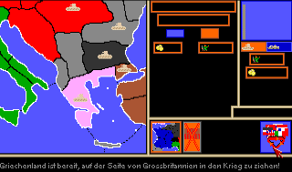
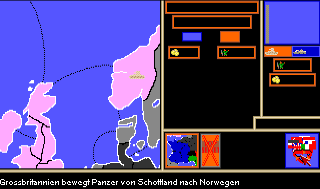

Assume the command of European [great powers](https://en.wikipedia.org/wiki/Great_power) on August 1914 (the eve of [World War I](https://en.wikipedia.org/wiki/World_War_I)) and manage the *military*, the *wartime economy* and *popular support*.

This is a [hotseat](https://en.wikipedia.org/wiki/Hotseat_(multiplayer_mode)) game for up to *seven players*. There is no [AI](https://en.wikipedia.org/wiki/Artificial_intelligence_in_video_games) so *at least two human players* are needed. For example, the first player controls [Entente](https://en.wikipedia.org/wiki/Allies_of_World_War_I) powers, whereas the other takes care of the [Central Powers](https://en.wikipedia.org/wiki/Central_Powers). For *seven players*, you enter a classic [free-for-all](https://en.wikipedia.org/wiki/Deathmatch_(video_games)) with each player controlling one great power.

The title *Economacy* is a [portmanteau](https://en.wikipedia.org/wiki/Blend_word) for economy and the board game [Diplomacy](https://en.wikipedia.org/wiki/Diplomacy_(game)).

The game design aims at giving the players the chance to experience first-hand the [race to the button](https://en.wikipedia.org/wiki/Race_to_the_bottom) by the great powers during WW1. The only means of winning the war are mobilization efforts and setting up an insustainable war economy. But this leads to economic degradation and decreasing levels of popular support. If not managed cautiously, revolutions spring up and put great powers out of the war. This is how WW1's armistice settlements finally came about.

The displayed tank divisions are an anachronism. But they serve well as an army icon...

# Map

This is the starting position. The differences to Diplomacy's provinces and setup also become clear from this map.


# Rules

Almost all of *Diplomacy*'s rules for military movement, support, and conflict resolution are valid and implemented in this game (except for the rule changes outlined below). In addition, the Diplomacy's map is also used with some alterations. However, *diplomatic* aspects are not part of the game and, thus, they can only be pursued outside of the game by *human-to-human* interaction.

The following describes the rules that are specific to this game. The [gallery](README.md#gallery) illustrates some of these points:
* **Basis**
	* *Province:* has an economic value and a popular support value towards each great power. Note that only the support towards the owner is displayed.
	* *Great power:* owns provinces and an amount of gold. In addition, the UI displays on the upper right corner the aggregate values derived from its provinces, i.e., the average popular support and the total number of armies and navies.
* **Great Power Finances**
	* *Taxes:* When collecting monthly taxes from its provinces, each great power applies a *war tax* rate. A rate above *10%* degrades popular support while a rate below restores it.
	* *Ongoing military costs:* Each army and navy costs *35* and *20* gold to support each month.
	* *Debt*: Ordinary actions are only available if the great power has enough gold. The only exception is mobilization which is allowed up to the debt of *300* gold. However, keep in mind that outstanding debt leads to inflation that, in turn, decreases popular support (*1%* for each *50* of debt outstanding).
* **Provincial Economy and Politics**
	* *Mobilization:* Each army and navy costs *150* and *145* respectively to build. In addition, the province that is ordered to mobilize suffers a *10%* drop of popular support and its economic value is decreased by *5*.
	* *Battle effects:* Attacks on the province (even failed ones) do harm to its economy. Furthermore, its popular support for the attacker drops.
	* *Tax revolts:* A province may refuse to pay taxes if its popular support is low.
	* *Secession:* For even lower support levels, it secedes and becomes either neutral or, if popular support for another great power is high, it joins the latter. Any army or navy stationed there is lost in the process. Note that a stationed army or navy lowers the popular support levels needed for a secession by *15%* and *10%* respectively.
* **Movement**
	* *Orders:* By clicking on the army or navy on the provincial pane, you can revisit the given orders at any time. They are executed at the end of each month.
	* *Convoys:* If passing through navy convoys, an army may not move to foreign provinces. This means that the navy is responsible for securing bridgeheads.
	* *Army vs. Navy:* If an army enters a foreign province in which a navy is stationed, the navy flees to the open sea (if possible) and leaves the province to the attacker.
* **Special Actions**
	* *Subsidies:* Raises popular support in targeted province by *2%* for the cost of *65* gold. This might still be worth the gold for pushing neutral countries to join the war. Note that neutrals' affinity to great powers is modeled historically (i.e., Serbia for Russia, Greece for Britain, ...).
	* *Spy:* Executed by clicking on the *"top secret"* button when viewing a province. This will display its economic value and popular support.
	* *Plunder:* The stationed army destroys *30%* of the province's economic value and extracts half of that as a one-time gold income. This leads to a *10%* drop of popular support in that province. Note that, as for other army orders, this action is only executed at the end of the month.

# How to Use

Put the repository into a mounted directory of an *emulated* [Amiga 500](https://en.wikipedia.org/wiki/Amiga_500) and run the executable in `bin` from the shell:
```
cd bin
Economacy
```

You can also start using the workbench (`info`-files provided).

The game language is *German* - but you only need to know some key words in order to play it.

The game is completely written in [Blitz Basic 2](https://de.wikipedia.org/wiki/Blitz_Basic). Its source code (both [ASCII](https://en.wikipedia.org/wiki/ASCII) and [tokenized](https://en.wikipedia.org/wiki/Lexical_analysis#Tokenization)) is also provided and can be run from the [IDE](https://en.wikipedia.org/wiki/Integrated_development_environment) if adjusting the compiler options:
* Default *Compile buffers* to be increased by factor *10*.
* *Object Maximums / Shapes* at least *250*.

# Gallery

## Popular Support

|  |
| :--: |
| Serbia has already joined hands with Russia |

|  |
| :--: |
| British subsidies push Greece into war |

|  |
| :--: |
| Popular support in Russia drops due to debts |

|  |
| :--: |
| Popular support in Livonia low<br>Province refuses to pay taxes |

|  |
| :--: |
| Poland secedes from Russia - army lost |

|  |
| :--: |
| Constantinople switches back to the Osmans |

## Special Actions

|  |
| :--: |
| Britain foments rebellion in the Rhineland |

|  |
| :--: |
| Germany conducts esponiage in Poland |

|  |
| :--: |
| Germany plunders Bulgaria |

## Military

|  |
| :--: |
| Italian navy must withdraw from French army |

|  |
| :--: |
| Galician army successfully supports<br>Hungary's army in attack on Romania |

| <br> |
| :--: |
| Navy in the Norwegian Sea acts as convoy<br>for the army from Scotland to Norway |

## Miscellaneous

|  |
| :--: |
| Menu for loading / saving games |
